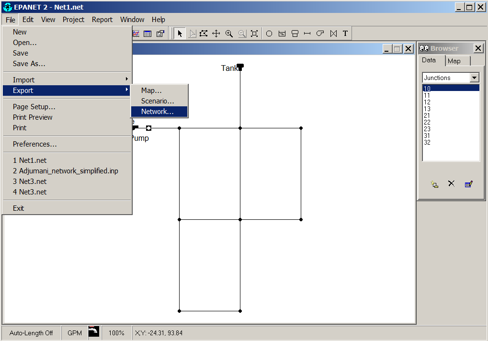
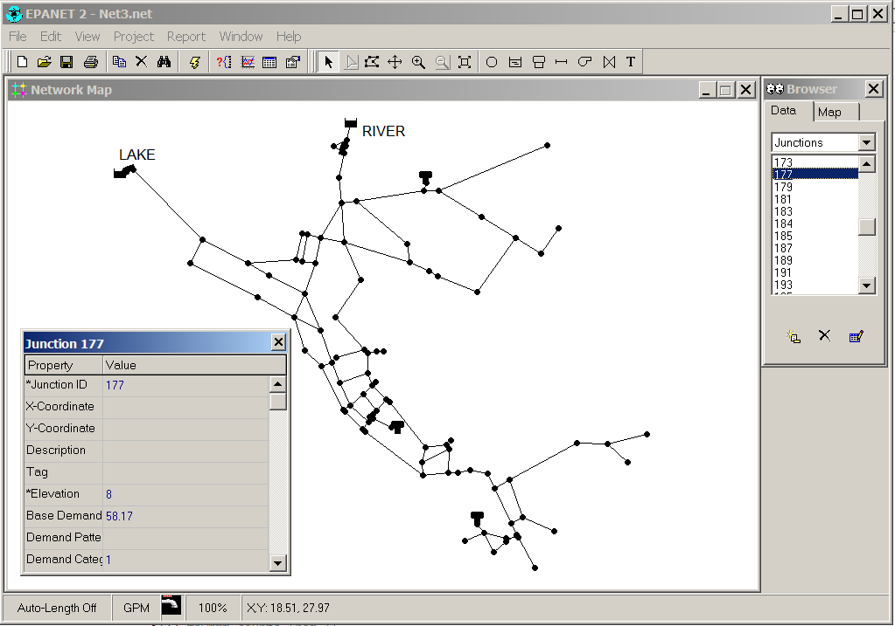

===============
Requirements
===============
Following information is required to do an analysis with RRPAM-WDS.

1. Water distribution Network in EPANET 2.0 network format (*****.inp****)
2. Reasonable estimations for the parameters of exponential aging formula :math:`N(t)=N_0 e^{A t}` after Shamir and Howard (1979).

These requirements are explained below:

Water distribution network
---------------------------
RRPAM-WDS works with water distribution networks created with EPANET 2.0 modeling software[2]_

.. [2] EPANET 2.0 model is available for download (including comprehensive documentation) at `https://www.epa.gov/water-research/epanet <https://www.epa.gov/water-research/epanet>`_.

EPANET 2.0 model uses two model file formats, namely ***\*.net*** format - which is a binary one and the text-based 'network file', *****.inp**** format. RRPAM-WDS can read the latter format. If the hydraulic network file is in ***\*.net*** format, it can be converted to a network (*****.inp**** ) file as follows:

1. Open the ***\*.net*** with EPANET 2.0 desktop software.
2. Use File > Export > Network menu item to export the network as ***\*.inp*** file.

   How to export ***\*.net*** file as *****.inp**** file.

Note: There are three example network files (in ***\*.inp*** provided with the software, these can obviously be used with RRPAM-WDS directly without the above conversion. These are available at the subdirectory ``rrpam_wds\examples``. For example on windows with default installation at ``C:\Program Files (x86)\rrpam-wds\rrpam_wds\examples``)

.. WARNING:: Typical EPANET 2.0 network files has coordinates of all the junctions. However, while creating the network if coordinates are omitted for one or more junctions, that does not raise any errors in the hydraulic calculations (coordinates are not needed for the calculations). An example of this is the standard example file ***Net3.net*** provided with EPANET 2.0. In this network, the junction with ID ***177*** does **not** have **X** and **Y** coordinates! EPANET 2.0 simply does not display this junction (and its connecting links) on the network map. But the user can access the junction and related links using However, RRPAM-WDS expects to have coordinates for all the junctions in the network file. If you try to open a file with missing coordinates, RRPAM-WDS will complain and fail to open the network.

   EPANET 2.0 network files can have junctions with no coordinates. In this network (***Net3.net***), ID ***177*** does **not** have **X** and **Y** coordinates.

Aging Parameters
-----------------
In RRPAM-WDS we use the exponential background-aging model after Shamir and Howard (1979)[1]_ which is :

.. math::
      N(t)=N_0 e^{A t}

:where:
    :math:`N(t)` - Number of failures per year per unit length (e.g. **#/km/year**)

    :math:`t` - Age of the asset (pipe)

    :math:`N_0` and :math: `A`  - Aging parameters

There are a number of techniques to estimate values of the aging parameters (e.g. empirical fit to pipe failure history if available) These techniques are beyond the scope of this tutorial. [3]_

.. [3] There are plans to create an add-on module to RRPAM-WDS that allows user to do regression analysis using failure history data. However, as this can be done with any spreadsheet software (like OpenOffice or Excel), this plan is not a priority at the moment.

.. [1] Shamir U, Howard C. An Analytical Approach to Scheduling Pipe Replacement (PDF). Journal-American Water Works Association. 1979 May 1;71(5):248-58. `PDF<http://shamir.net.technion.ac.il/files/2012/04/1979-Shamir-and-Howard-Pipe-Replacement-JAWWA.pdf>`_
