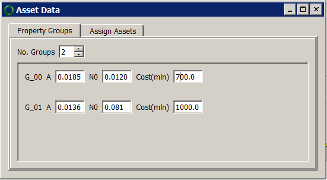

Getting Started
===============
.. Attention::
    Make sure that you have the required data ready before starting on this section. Refer to section :doc:`Requirements </tutorial01>`.

There are a number of example EPANET 2.0 network files provided with RRPAM-WDS. They are available at :code:`rrpam_wds\examples` directory relative to your RRPAM-WDS installation. (e.g. In windows this is usually :code:`C:\Program Files (x86)\rrpam-wds\rrpam_wds\examples`) For this walk-though we use the example :code:`Adjumani_network_simplified2.inp`. This network is a hypothetical case loosely based on a actual case study from Sub-Saharan Africa.

Step 1
------
First create a new project, which will ask you to locate the EPANET 2.0 file that you want to use in your project.

.. figure:: images/new_project.PNG
   :scale: 100 %
   :alt: Create a new project

Navigate to the location of :code:`Adjumani_network_simplified2.inp` and select that file.

.. figure:: images/new_project2.PNG
   :scale: 100 %
   :alt: Locate :code:`Adjumani_network_simplified2.inp` file.

Then you will be asked to select a location to save your project. While it is possible to save a new project in any location in your computer, it is advised to create a new directory and save your project inside that.

.. figure:: images/new_project3.PNG
   :scale: 100 %
   :alt: Create a new directory :code:`my_project`

.. figure:: images/new_project4.PNG
      :scale: 100 %
      :alt: Go to the directory :code:`my_project` and save your project.

As shown about, for this example I created a directory :code:`my_project` on the Desktop and saved the project as :code:`project1` inside it.

At this stage RRPAM-WDS will take a few seconds to perform hydraulic analysis on the network and show the following things:

1. A diagram representing the hydraulic network;
2. A list of 'links' of the network with their basic properties.
3. A representation of the risk-matrix (We have not provided any information of the failure probabilities, so for the moment just ignore this window.)

.. figure:: images/new_project5.PNG
      :scale: 70 %
      :alt: New project successfully created.

Step 2
------

At this stage we need to input the failure rate data. We need to provide aging parameters (:math:`N_0` and :math:`A`) and the Age of each pipe (link) at the time of analysis.

RRPAM-WDS facilitates input of aging parameters based on asset groups. Let's assume two groups of pipes. Following are the aging parameters estimated for each group. The last column gives the cost of replacement for a km of pipe in terms of millions of financial units.

+-----------------------+--------------------+---------------+---------------+
|  Diameter Range       | :math:`N_0`        | :math:`A`     |Cost (mil/km)  |
+=======================+====================+===============+===============+
| :math:`d\ \leq` 80 mm | 0.0291             | 0.0185        | 0.7           |
+-----------------------+--------------------+---------------+---------------+
| 80 mm :math:`\gt\ d`  | 0.0222             | 0.0136        | 1.0           |
+-----------------------+--------------------+---------------+---------------+

Go to the :strong:`Asset Data` window and select and select :strong:`Property Groups` tab,  Change the number of groups to 2 and enter the above values.

Now the next step is to assign each pipe to one of these two groups. Go to the :strong:`Assign Assets` tab on the :strong:`Asset Data` (same) window. Use the table below to read the Age values.

:Note: For those pipes with IDs not explicitly given in the table, use the default value ( listed in the last row of the table with ID='OTHERS').

+----------+-------------+
|  Pipe ID | Age (Years) |
+==========+=============+
| TX       | 35          |
+----------+-------------+
| P1       | 20          |
+----------+-------------+
| P2       | 20          |
+----------+-------------+
| P9       | 30          |
+----------+-------------+
| P10      | 32          |
+----------+-------------+
| P3       | 20          |
+----------+-------------+
| P11      | 35          |
+----------+-------------+
| P4       | 20          |
+----------+-------------+
| P5       | 20          |
+----------+-------------+
| P13      | 35          |
+----------+-------------+
| P17      | 35          |
+----------+-------------+
| P24      | 35          |
+----------+-------------+
| P27      | 35          |
+----------+-------------+
| P28      | 35          |
+----------+-------------+
| P50      | 35          |
+----------+-------------+
| OTHERS   | 20          |
+----------+-------------+
