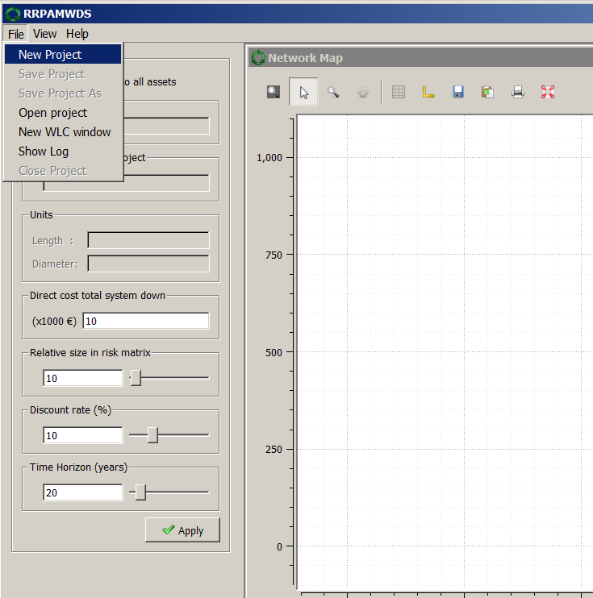
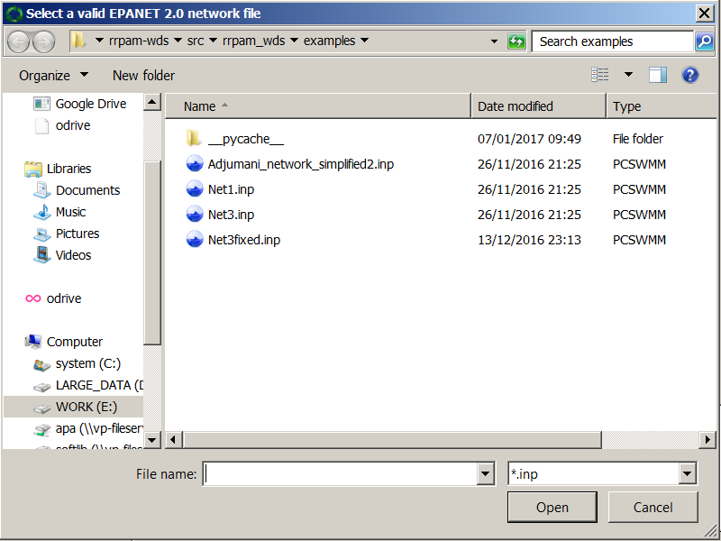
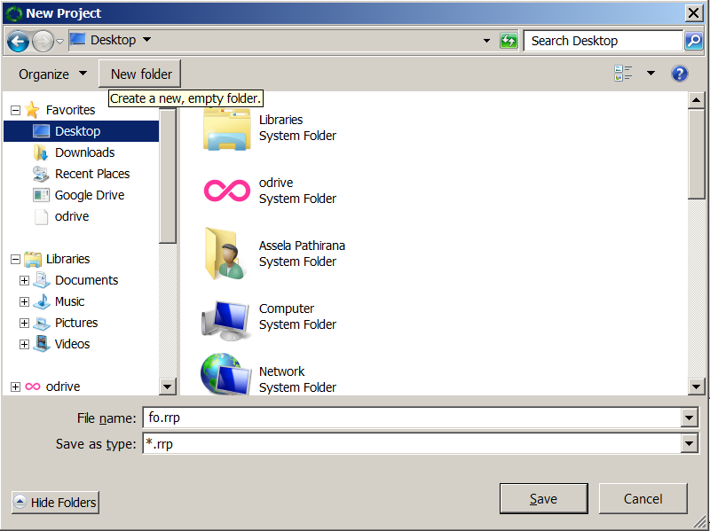
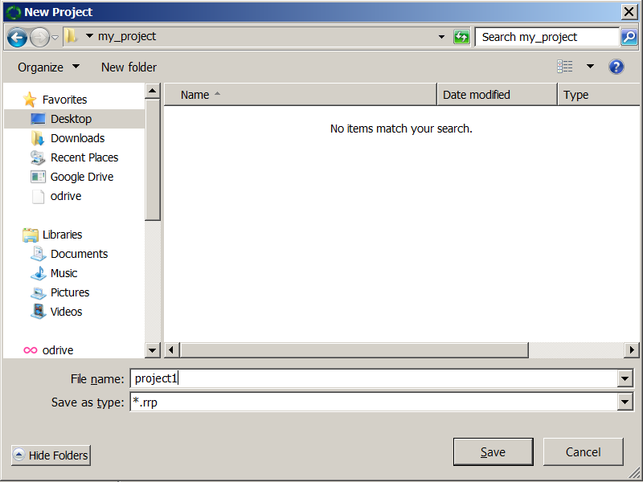
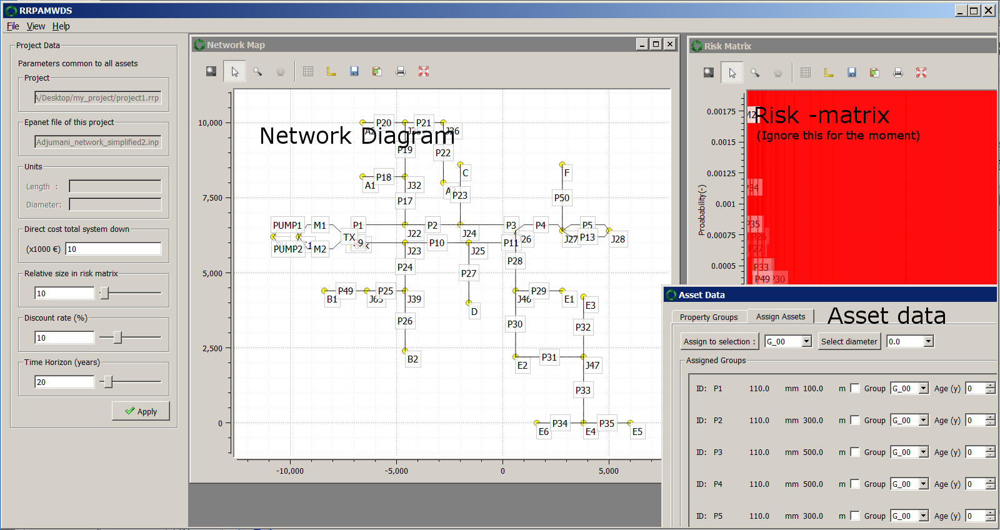

===============
Getting Started
===============
.. Attention::
    Make sure that you have the required data ready before starting on this section. Refer to section :ref:`requirements_`.

There are a number of example EPANET 2.0 network files provided with RRPAM-WDS. They are available at :code:`rrpam_wds\examples` directory relative to your RRPAM-WDS installation. (e.g. In windows this is usually :code:`C:\Program Files (x86)\rrpam-wds\rrpam_wds\examples`) For this walk-though we use the example :code:`Adjumani_network_simplified2.inp`. This network is a hypothetical case loosely based on a actual case study from Sub-Saharan Africa.

Step 1
======
First create a new project, which will ask you to locate the EPANET 2.0 file that you want to use in your project.

Navigate to the location of :code:`Adjumani_network_simplified2.inp` and select that file.

Then you will be asked to select a location to save your project. While it is possible to save a new project in any location in your computer, it is advised to create a new directory and save your project inside that.

As shown about, for this example I created a directory :code:`my_project` on the Desktop and saved the project as :code:`project1` inside it.

At this stage RRPAM-WDS will take a few seconds to perform hydraulic analysis on the network and show the following things:

1. A diagram representing the hydraulic network;
2. A list of 'links' of the network with their basic properties.
3. A representation of the risk-matrix (We have not provided any information of the failure probabilities, so for the moment just ignore this window.)

