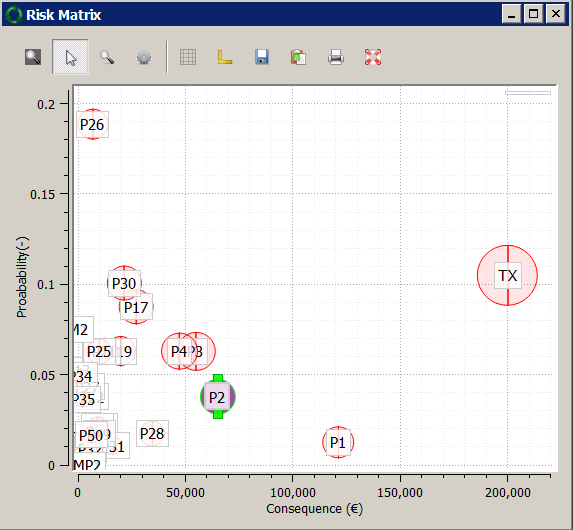
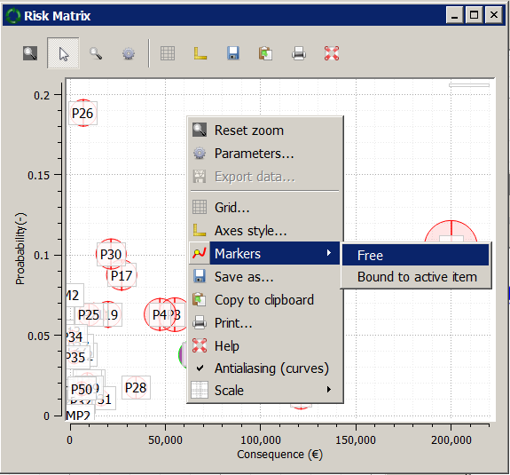
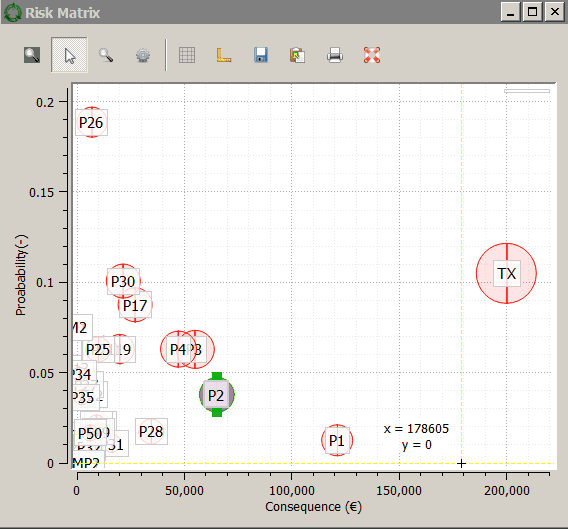

Getting Started-II
==================

At this point, you can examine the :strong:`risk matrix` window. Adjust the value of :strong:`relative size in risk-matrix` value, so that the circles representing assets have diameters of your liking (:code:`0.02` worked well at the time of writing).

.. Note::

   It is possible to explore the :strong:`Network Map`, :strong:`Asset Data` and :strong:`Risk Matrix` windows together by selecting assets (by right-clicking with the mouse in case of graphs or by ticking the check-box next to each asset in the case of :strong:`Assign Assets` tab in the :strong:`Asset Data` window). When an asset is selected in one window, it will be selected in all views. Use :strong:`Ctrl + Mouse Click` key to select more than one asset.

All the graph windows in the software allow the user to examine data by creating 'cross-hairs' with coordinates on the graphs.

Step 3
------
