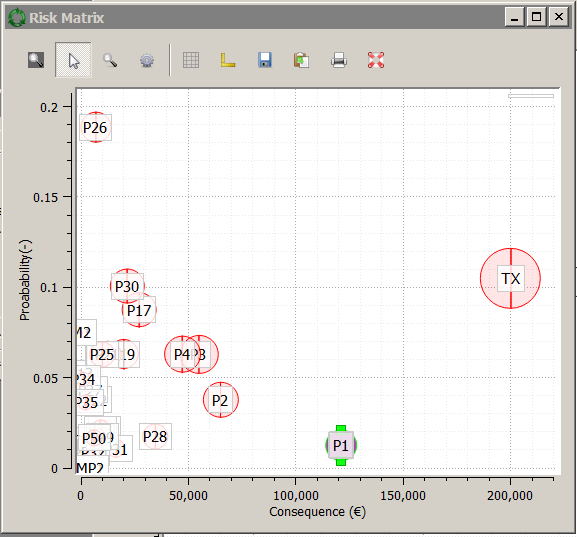
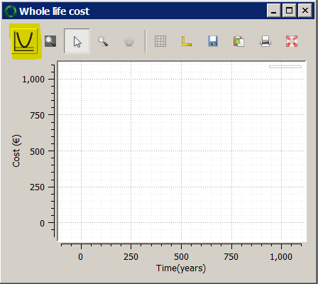
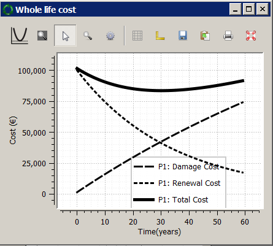

Getting Started-II
==================

At this point, you can examine the :strong:`risk matrix` window. Adjust the value of :strong:`relative size in risk-matrix` value, so that the circles representing assets have diameters of your liking (:code:`0.02` worked well at the time of writing).

.. figure:: images/risk_matrix1.PNG
   :scale: 100 %
   :alt: Risk-matrix

.. Note::

   It is possible to explore the :strong:`Network Map`, :strong:`Asset Data` and :strong:`Risk Matrix` windows together by selecting assets (by right-clicking with the mouse in case of graphs or by ticking the check-box next to each asset in the case of :strong:`Assign Assets` tab in the :strong:`Asset Data` window). When an asset is selected in one window, it will be selected in all views. Use :strong:`Ctrl + Mouse Click` key to select more than one asset.

All the graph windows in the software allow the user to examine data by creating 'cross-hairs' with coordinates on the graphs.

There are number of other facilities provided with these graphs like :strong:`rectangular-zoom/reset`, :strong:`change axes scales/styles`, :strong:`Save graphs` in variety of formats, etc. Go explore!

.. figure:: images/risk_matrix2.PNG
   :scale: 100 %
   :alt: Cross-hairs

.. figure:: images/risk_matrix3.gif
   :scale: 100 %
   :alt: Cross-hairs in action.

Step 3
------

Now it is the time to explore the :strong:`Whole life cost` window.

Select an asset in the system (e.g. click the asset's representation in one of the graphs or tick the correct box in the :strong:`Assign Assets` tab in :strong:`Asset Data` window). The selected asset (:code:`P1` in this case) will be highlighted in all active windows.

Make sure that the :strong:`Discount Rate' value is set to :code:`3 %` and the :strong:`Time Horizon (years)` to 60. Now go to a :strong:`Whole Life Cost` windows and click on the curve icon on the top toolbar.

This will create the :strong:`Whole life cost` curve for the asset :strong:`P1`

.. Note::
  It is possible to create variety of combination of :strong:`Whole life cost` curves in the software.

  1. It is possible to plot multiple curves in the same graph (simply select them and click on the curve icon.)
  2. It is possible to create more than one :strong:`Whole Life Cost` graphs. (:code:`File>New WLC window`)

.. Tip::
   It is possible to change variety of parameters related to your project and see how those changes will impact your results. For example, you can change :strong:`Discount rate (%)` value (and press :strong:`Apply` Button) or :strong:`Age` of one of the asset parameters. These will update the :strong:`Whole life cost` curves and the :strong:`Risk Matrix` values.
